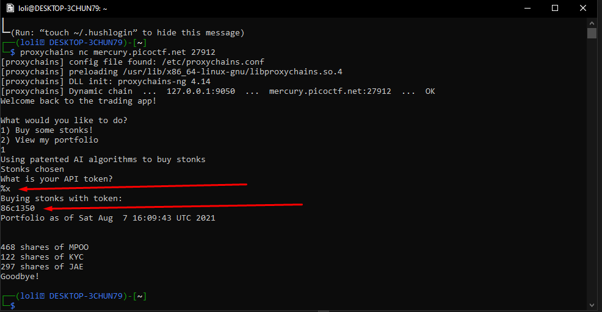
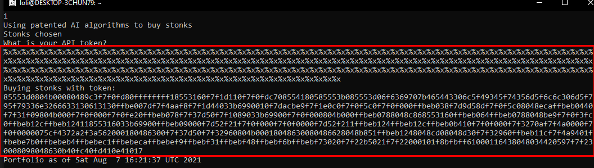
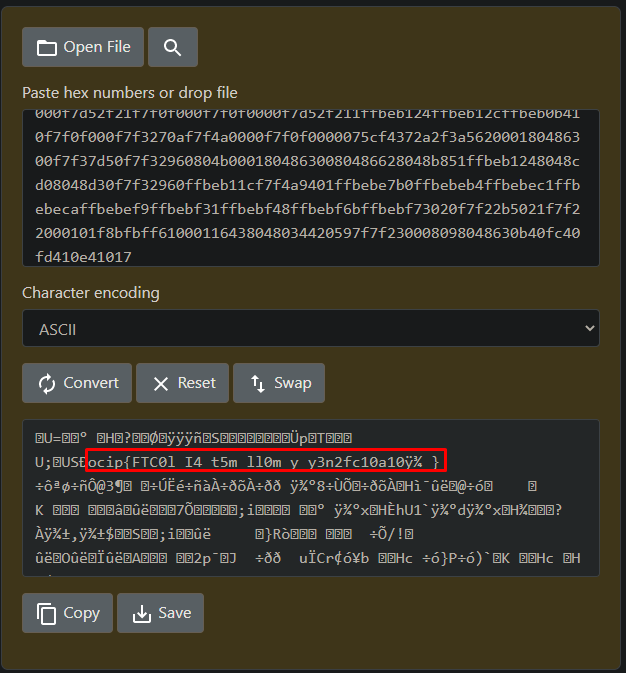
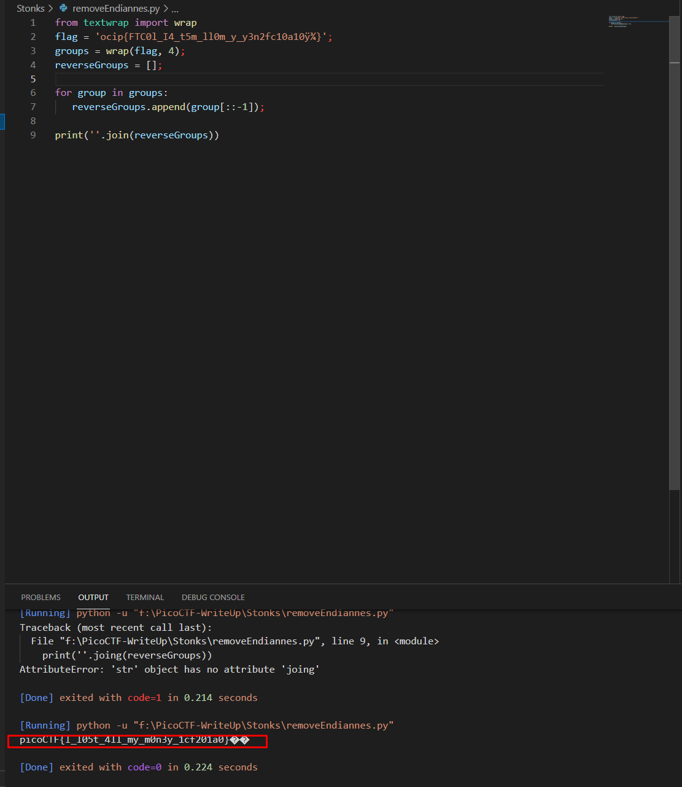

# Problem
I decided to try something noone else has before. I made a bot to automatically trade stonks for me using AI and machine learning. I wouldn't believe you if you told me it's unsecure! vuln.c nc mercury.picoctf.net 27912
# Soltuion
In vulnc.c I was able to spot a vurnability on line 93. Which should allow me to specify any string format I want. I connected to the vurnable instance and tested this vurnability out. The presence of the hexadecimal address after the
> Buying stonks with token:

indeed confirms this.

Now lets repeat that a few more times so we get more info.

Success!. Now I have spotted some values which are probably ASCII. Lets check it out.

This looks like a flag for sure. All that is left to do is get rid of its endianness. I wrote a short script which does that for us. We know that all PicoCTF flags start with picoCTF so we can assume its four bits.
